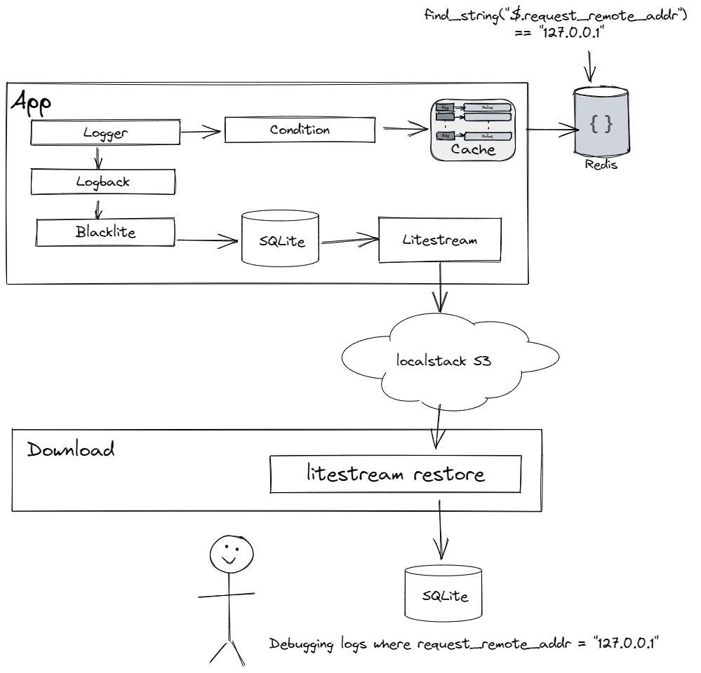
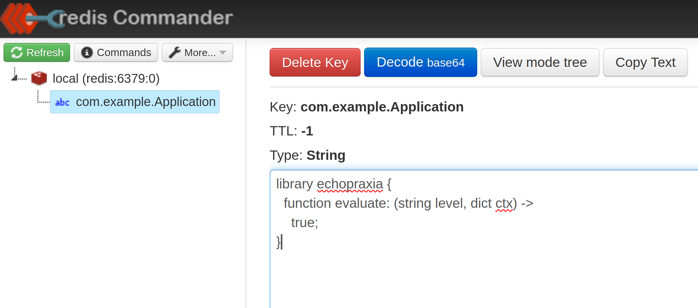

# Dynamic Debug Logging

This is a proof of concept using docker compose that shows an application running with dynamic debug logging -- logging that can be targeted to log only a particular session id or IP address at runtime, without restarting the application.

## Rationale

Assume that you have an application running in production.  

You want to enable some debug statements in the application, but only some of them.  You could be testing out a new feature, hunting down a bug, or verifying the execution flow.

Once you have these debugging statements, you want to dump them out of the application and examine them in detail, without going through your operational logging stack (ELK, Splunk, etc).  You may want to pull logs from multiple instances or multiple services and make them all available at once so you can track the flow across logs.

## Overview

The Spring Boot application in `app` runs and conditionally produces debug statements on every request, using a structured logging framework called [Echopraxia](https://github.com/tersesystems/echopraxia).  

The condition attached to the logger runs using a cached reference to a [Tweakflow script](https://github.com/tersesystems/echopraxia#dynamic-conditions-with-scripts) on Redis, and looks up the script at `com.example.Application`. If the script evaluation returns true, then the logger will produce a statement -- if there is no script, then the logger will operationally log at `INFO` and above.  The cache will [refresh](https://github.com/ben-manes/caffeine/wiki/Refresh) from Redis asynchronously, so if the script has changed on Redis then the cache will be updated.  

Tweakflow is [specificially designed](https://twineworks.github.io/tweakflow/#why-tweakflow) to be limited and secure in what data it accesses, and it is possible to [limit execution time](https://twineworks.github.io/tweakflow/embedding.html#limiting-evaluation-time) to prevent denial of service, using an `AsyncLogger`.

Logging output is written to a bounded, row-limited SQLite database at `/app/app.db` using [Blacklite](https://github.com/tersesystems/blacklite).  This database is observed by [litestream](https://litestream.io/) which asynchronously replicates changes to the S3 location in [localstack](https://github.com/localstack/localstack), ensuring that the logs are available in a secure and reliable location.

Finally, the litestream replication data can be called from another Spring Boot application `download` to restore a database from localstack, making logs available for use outside the application.

Here's a picture showing a happy user getting their logs.



## Running

You can run the docker compose file as normal once you've [installed it](https://docs.docker.com/compose/install/).

```
docker-compose up --build
```

And the local application will be available at [`http://localhost:8080/`](http://localhost:8080).  Hitting the URL will call `logger.debug`, but nothing will be logged until a script is present and returning `true`.

During this time, the application will send operational logging output to an SQLite database, and that database will be asynchronously replicated to a localstack S3 bucket using [litestream](litestream.io/).

## Editing

To change the script, go to [`http://localhost:8081`](http://localhost:8081) to run Redis Commander.

Enter the key value as `com.example.Application` with the following [Tweakflow script](https://github.com/tersesystems/echopraxia#dynamic-conditions-with-scripts) as value:

```
library echopraxia {
  function evaluate: (string level, dict ctx) ->
    true;
}
```



You can also search for conditions matching against arguments.  For example, using `find_string`:

```
library echopraxia {
  function evaluate: (string level, dict ctx) ->
    let {
      find_string: ctx[:find_string];
    }
    find_string("$.name") == "World";
}
```

## Download

To download and extract the litestream replication data into an SQLite database from localstack S3, you can go to [`http://localhost:9001/`](http://localhost:9001).  A Spring Boot application will call [`litestream restore`](https://litestream.io/reference/restore/) and provide the SQLite database for download.

## Analysis

Once you've downloaded the database, you can use [DB Browser for SQLite](https://sqlitebrowser.org/) to query the database, including JSON in the `content` column using [`json_extract`](https://www.sqlite.org/json1.html#jex):

```sql
select 
	json_extract(content, "$.id") as id, 
	json_extract(content, "$.logger_name") as logger_name,
	json_extract(content, "$.@timestamp") as timestamp,
	json_extract(content, "$.message") as message
FROM entries
```

You also have the option of visualizing the sqlite database using [Datasette](https://datasette.io/) or [Observable](observablehq.com/) using [SQL + Chart](https://observablehq.com/@observablehq/sql-chart), or querying using a [notebook interface](https://tersesystems.com/blog/2019/09/28/applying-data-science-to-logs-for-developer-observability/).

## Scaling

Finally, although it's not shown here, you can leverage SQLite dump and import tools to aggregate multiple logs together into a single database with multiple tables, and use `UNION` to query across all multiple tables.   
